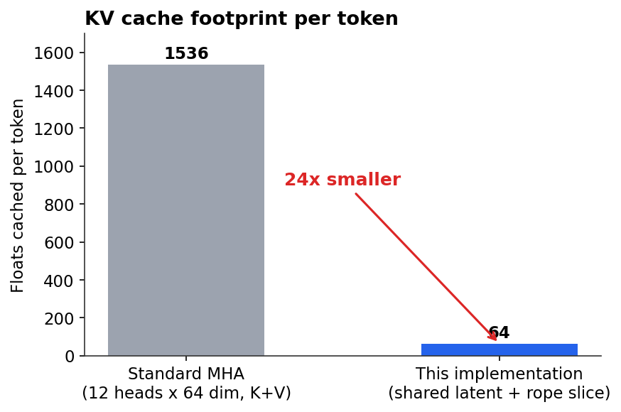
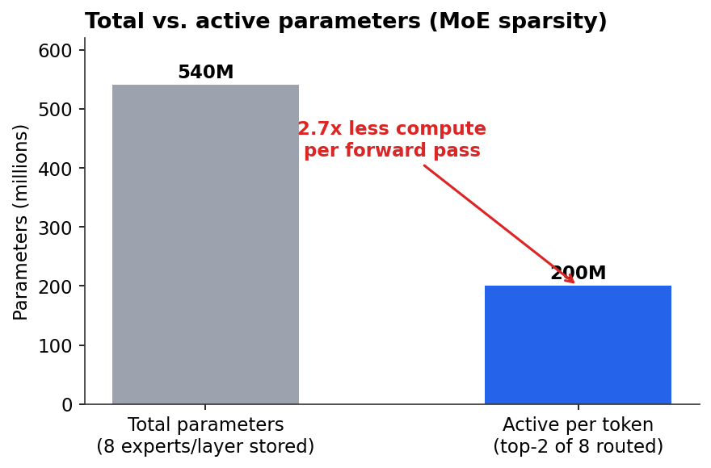
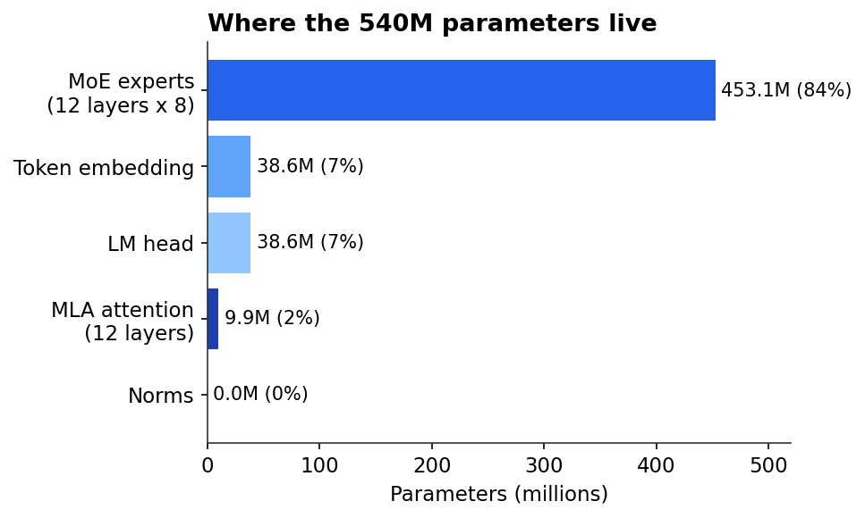

# AxiomLLM

A decoder-only transformer language model, built from scratch in PyTorch, around two engineering decisions: attention that caches a compressed latent instead of full-size keys and values, and a feed-forward layer that routes each token to a small subset of experts instead of running one dense MLP on every token. Trained end-to-end — tokenizer, data pipeline, model, training loop, and inference — with no `transformers.Trainer`, no borrowed model definitions.

Pretrained checkpoint: [huggingface.co/itsraunak-work/axiomllm](https://huggingface.co/itsraunak-work/axiomllm)

## The problem this is solving

Two inefficiencies in a standard transformer decoder motivated the design:

**1. KV cache grows linearly with heads.** In standard multi-head attention, autoregressive generation requires caching a full-size key and value vector *per head, per token*. For a 12-head, 768-dim model, that's $2 \times 12 \times 64 = 1536$ floats cached per token. That cache is the dominant memory cost at long context lengths, and it scales with the number of heads even though heads mostly share redundant information.

**2. A dense FFN spends the same compute on every token.** Whether a token needs simple or complex processing, a standard MLP runs the full parameter set on it every time. Model capacity (total parameters) and compute cost (FLOPs per token) are locked together — the only way to add capacity is to add compute.

The two components below address these separately.

## Attention: compress the cache, decouple position from content

Instead of projecting the input into full-size per-head keys and values, the input is first down-projected into one small shared latent vector, then up-projected back into per-head K/V on the fly. Only the latent needs to be cached — its size doesn't depend on the number of heads.

**Down-projection** (shared across all heads):

$$c_t^{KV} = W_{DKV} \, h_t \in \mathbb{R}^{r_{kv}}$$

where $h_t$ is the hidden state at position $t$ and $r_{kv}$ = `kv_lora_rank`. This $c_t^{KV}$ is the only thing that gets cached during generation.

**Up-projection** (per head $i$, reconstructed when needed):

$$k_{t,i}^{C} = W_{UK,i} \, c_t^{KV}, \qquad v_{t,i} = W_{UV,i} \, c_t^{KV}$$

**The RoPE complication.** Rotary position embeddings rotate a vector based on its absolute position. Rotating *before* the down-projection means the rotation angle gets baked into the compressed latent, which breaks the ability to reconstruct K on the fly independent of position. The fix used here is to decouple: split each head's query and key into a "content" part (derived from the latent, never rotated) and a small separate "positional" part (computed directly from the input, always rotated):

$$q_{t,i} = \big[\, q_{t,i}^{C} \;;\; \mathrm{RoPE}(q_{t,i}^{R}) \,\big], \qquad k_{t,i} = \big[\, k_{t,i}^{C} \;;\; \mathrm{RoPE}(k_t^{R}) \,\big]$$

Critically, $k_t^{R}$ (dimension $d_r$ = `qk_rope_head_dim`) is computed **once per token, shared across every head** — rotated a single time and broadcast — rather than once per head. That sharing is most of where the cache saving comes from: the cache holds $c_t^{KV}$ ($r_{kv}$ floats) plus one shared $k_t^{R}$ ($d_r$ floats), independent of the number of attention heads entirely.

**Attention itself** proceeds as usual once $q$ and $k$ are assembled:

$$\mathrm{Attn}_i(t) = \sum_{s \le t} \mathrm{softmax}\!\left(\frac{q_{t,i}^\top k_{s,i}}{\sqrt{d_{nope}+d_r}}\right) v_{s,i}$$

The query side is optionally compressed the same way via a `q_lora_rank`-dimensional latent — this doesn't shrink the cache (queries are never cached), it only reduces activation memory during training.

### Measured effect

At this project's trained configuration ($r_{kv}=32$, $d_r=32$, 12 heads, head dim 64):

| | Floats cached per token |
|---|---|
| Standard multi-head attention | $2 \times 12 \times 64 = 1536$ |
| This implementation | $32 + 32 = 64$ |



A 24x reduction, and it's structural — it doesn't depend on the specific weights, it falls straight out of the dimensions.

## Feed-forward: route instead of running everything

Rather than one dense SwiGLU block per layer, each layer holds $N$ (`num_experts` = 8) independent SwiGLU experts and a router. Each token is scored against all experts, the top $K$ (`top_k` = 2) are selected, and only those two experts actually process that token:

$$g_t = W_r h_t \in \mathbb{R}^N, \qquad p_t = \mathrm{softmax}(g_t)$$

$$\mathcal{T}_t = \mathrm{top}_K(p_t), \qquad w_{t,j} = \frac{p_{t,j}}{\sum_{j' \in \mathcal{T}_t} p_{t,j'}} \;\; \text{for } j \in \mathcal{T}_t$$

$$y_t = \sum_{j \in \mathcal{T}_t} w_{t,j} \cdot \mathrm{SwiGLU}_j(h_t), \qquad \mathrm{SwiGLU}(x) = W_2\big(\mathrm{SiLU}(W_1 x) \odot W_3 x\big)$$

**The routing-collapse problem.** With no constraint on the router, gradient descent has no reason to spread tokens evenly across experts — it's easy for training to collapse onto 1–2 favored experts while the rest sit idle and undertrained. An auxiliary load-balancing loss is added to the training objective to counteract this:

$$f_i = \frac{1}{TK}\sum_{t=1}^{T} \mathbb{1}[i \in \mathcal{T}_t], \qquad P_i = \frac{1}{T}\sum_{t=1}^{T} p_{t,i}$$

$$\mathcal{L}_{aux} = N \sum_{i=1}^{N} f_i \, P_i$$

$f_i$ is the *actual* fraction of routing decisions that went to expert $i$; $P_i$ is the *average probability mass* the router assigned to expert $i$ across all tokens (whether or not it was selected). At perfect balance, $f_i = P_i = 1/N$ for every expert, giving $\mathcal{L}_{aux} = 1$ exactly — this is a real invariant I checked by running the module directly, not just a claim: at $N=8$, random init, increasing batch size from 16 to 4096 tokens, the measured aux loss converges to $1.0002$.

Total training objective:

$$\mathcal{L} = \mathcal{L}_{CE} + \alpha \, \mathcal{L}_{aux}, \qquad \alpha = 0.01$$

### Measured effect

Storing 8 experts per layer costs parameters, but only 2 run per token, so compute per forward pass is well below what the total parameter count implies:

| | Millions of parameters |
|---|---|
| Total (all 8 experts stored) | 540 |
| Active per token (top-2 routed) | 200 |



That's 2.7x fewer active parameters per token than the total footprint suggests — the capacity/compute decoupling the MoE design is meant to buy.

### Where the parameters actually go



Expert storage dominates (84%), followed by the embedding and output head (14% combined — currently untied, see Known Issues). Attention is a rounding error by comparison (1.8%) — the whole point of compressing it was that it was never where the parameter or cache budget should go.

## Implementation map

| Concept above | Code |
|---|---|
| $c_t^{KV}$, $k_t^R$ down-projection | `MultiHeadLatentAttention.kv_down_proj` in `src/model.py` |
| Per-head up-projection | `MultiHeadLatentAttention.kv_up_proj` |
| Decoupled RoPE application | `MultiHeadLatentAttention.forward`, the `q_nope`/`q_rope` and `k_nope`/`k_rope` splits |
| Router + top-k selection | `MoE.forward`, `torch.topk` on `routing_weights` |
| $\mathcal{L}_{aux}$ | `MoE.forward`, `f_i` / `P_i` / `aux_loss` |
| $\mathcal{L} = \mathcal{L}_{CE} + \alpha\mathcal{L}_{aux}$ | `scripts/train.py`, `loss = ce_loss + (0.01 * aux_loss)` |

Everything else (`RMSNorm`, `RoPE`, `SwiGLU`) is a fairly direct implementation of well-known building blocks and isn't worth re-deriving here — read `src/model.py` directly, every non-obvious tensor reshape has an inline shape comment.

## Training setup

| | |
|---|---|
| Dataset | `roneneldan/TinyStories`, `train` split, first 5,000 samples |
| Epochs | 3 |
| Batch size | 2, gradient accumulation 8 (effective batch 16) |
| Learning rate | 3e-4, AdamW, weight decay 0.1 |
| Precision | bf16 autocast |
| Hardware | 1x NVIDIA T4 (Colab, free tier) |
| Seed | 42 |

**Known limitation of this specific run**: 5,000 stories is a small fraction of TinyStories' ~2.1M total, and `max_samples=5000` is currently hardcoded in `scripts/train.py`. The released checkpoint is a proof that the architecture trains end-to-end without NaNs, shape errors, or router collapse — not a claim about output quality at scale. Model config in `configs/default.yaml`, checkpoint and tokenizer on the [Hugging Face repo](https://huggingface.co/itsraunak-work/axiomllm).

## Known issues / open work

- **Embedding and LM head aren't tied.** Both are $50257 \times 768 = 38.6\text{M}$ params; tying them (standard practice) would save one of those two blocks for free.
- **Dead config fields**: `head_dim`, `use_rope`, `dropout`, `mla_rank` are defined in `ModelConfig`/`default.yaml` but never read by `model.py` — leftovers from an earlier version. `dropout: 0.1` in particular implies regularization that isn't actually applied anywhere.
- **No nucleus/top-k filtering at inference** — `scripts/chat.py` samples with temperature only.
- **T4 has no native BF16 tensor-core support** (that's Ampere-and-later hardware). Training likely ran without the acceleration bf16 autocast is meant to provide; fp16 + `GradScaler` (already implemented in `train.py`) would typically be faster on a T4.

## Project structure

```
axiomllm/
├── configs/default.yaml    # model + training hyperparameters
├── scripts/
│   ├── chat.py              # inference REPL
│   ├── test_model.py        # unit tests
│   ├── train.py              # training loop
│   └── verify.py              # environment/config check
├── src/
│   ├── config.py              # dataclass config schema + YAML loader
│   ├── data.py                  # streaming dataset + token packing
│   ├── model.py                   # RMSNorm, RoPE, MLA, SwiGLU, MoE, AxiomLLM
│   ├── tokenizer.py                 # BPE tokenizer wrapper
│   └── utils.py                       # logging, seeding, device, param counting
├── docs/charts/                       # the charts above, regeneratable from measured numbers
├── requirements.txt
└── LICENSE (MIT)
```

## Usage

```bash
git clone https://github.com/itsraunak-work/axiomllm.git
cd axiomllm
pip install -r requirements.txt

python scripts/verify.py     # environment + config check
python scripts/test_model.py # unit tests
python scripts/train.py      # train from scratch
python scripts/chat.py       # chat with a trained checkpoint
```

To use the released checkpoint instead of training your own: download it and the tokenizer from [the Hugging Face repo](https://huggingface.co/itsraunak-work/axiomllm) into `checkpoints/axiomllm_epoch_3.pt` and `assets/axiom_tokenizer.json`, then run `scripts/chat.py`.

## References

The low-rank KV compression and sparse expert routing implemented here are general techniques with prior art in several published architectures and the Switch Transformer line of MoE work; both are re-derived and implemented independently in this repo rather than ported from any existing codebase.

## License

MIT — see [LICENSE](LICENSE).